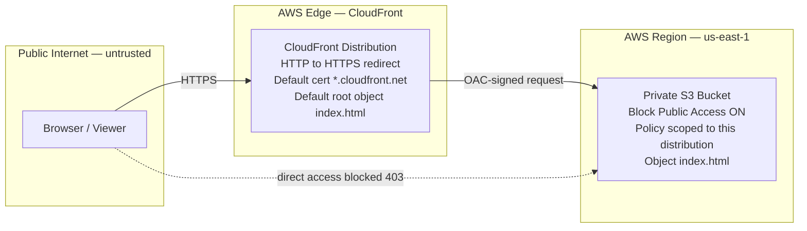

# Cloud Resume — Static Site on AWS (S3 + CloudFront + OAC)

A single-page résumé served as a static website on AWS, built **private-by-default**: the origin S3 bucket blocks all public access, and only the CloudFront distribution can read it through Origin Access Control (OAC). All viewer traffic is forced over HTTPS.

- **Live:** https://djt4zmhvif6vg.cloudfront.net
- **Region:** us-east-1

## Architecture



Trust boundaries cross from the public internet, to the CloudFront edge, to the private S3 origin in-region. The origin is never exposed directly — a request straight to the S3 object URL is denied (HTTP 403).

## Security controls

- **Private origin (Block Public Access ON).** The S3 bucket blocks all public ACLs and bucket policies. The résumé object is not publicly reachable.
- **Origin Access Control (OAC).** CloudFront signs its requests to S3 (SigV4). The bucket policy grants read access only to this specific distribution, so S3 serves the object to CloudFront and to nothing else.
- **HTTPS enforced.** The CloudFront viewer protocol policy redirects HTTP to HTTPS, so the site is only ever served over TLS.
- **TLS certificate.** Uses the default CloudFront `*.cloudfront.net` certificate. No ACM certificate is provisioned, because the site has no custom domain.
- **Default root object.** CloudFront serves `index.html` at the distribution root.

## Verification

The posture was confirmed end-to-end:

- **Direct-to-origin is blocked** — requesting the S3 object URL directly returns **HTTP 403**, confirming the bucket is private and reachable only through CloudFront/OAC.
- **HTTP is redirected to HTTPS** — an `http://` request to the distribution returns a **301** to the `https://` URL.

```bash
# Direct-to-origin should be denied (replace with your bucket name)
curl -I https://<agastya-project-static-website>.s3.us-east-1.amazonaws.com/index.html   # -> 403 Forbidden

# HTTP should redirect to HTTPS
curl -I http://djt4zmhvif6vg.cloudfront.net                            # -> 301 to https://...
```

## Future hardening

Not yet implemented — tracked as next steps:

- **Security response headers** via a CloudFront response-headers policy: HSTS, Content-Security-Policy, X-Content-Type-Options, Referrer-Policy.
- **CloudFront access logging** to a dedicated S3 log bucket for request visibility.
- **Custom domain + ACM** — if a domain is acquired, add Route 53 plus an ACM certificate (must be in us-east-1 for CloudFront) and an alternate domain name on the distribution.
- **AWS WAF** in front of CloudFront for L7 filtering and rate limiting.
- **Origin object versioning / CloudTrail data events** for change tracking and audit.
